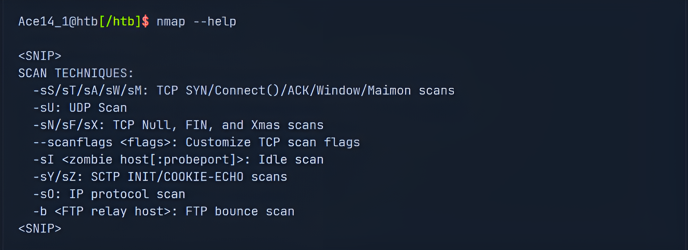
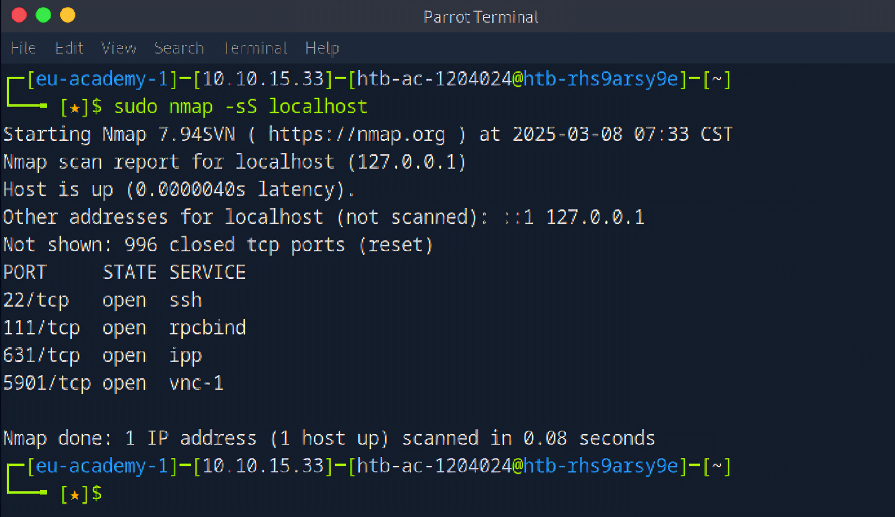
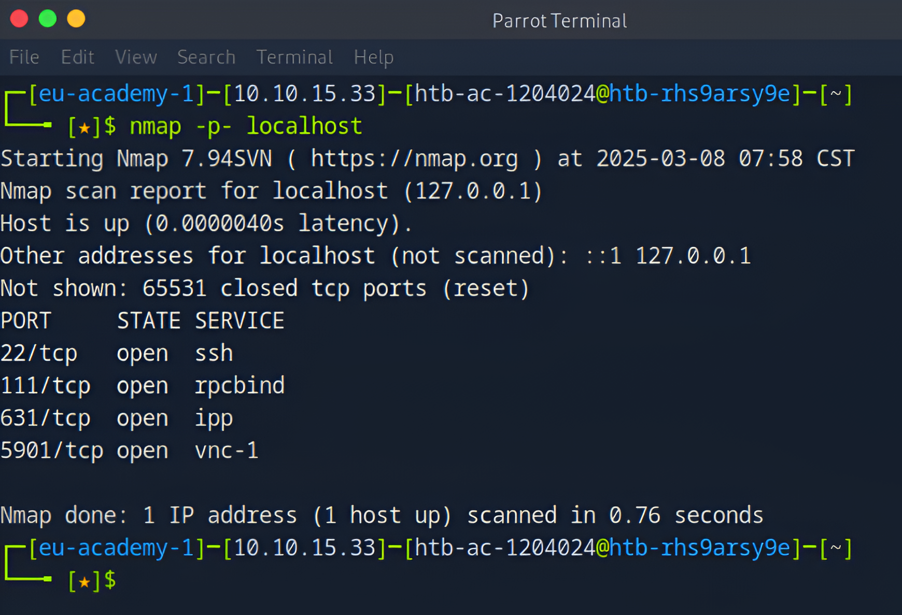

_Created by Matthew Adriaanzen_

Nmap is a network scanner created by Gordon Lyon. its used to discover hosts and services on a computer network by sending packets and analyzing the responses.

It provides a number of features for probing computer networks, including host discovery and service and operating system detection.

Some of the features of Nmap can be divided into the following scanning techniques:

*  Host discovery
*  Port scanning
*  Service enumeration & detection
*  OS detection

## Prerequisites
Before following this guide, you should have a basic understanding of:

*  Networking fundamentals (IP addresses, subnets, and ports).
*  Operating systems (basic Linux or Windows command-line usage).
*  Security concepts (understanding what open ports and services mean).

This guide focuses only on using Nmap for network scanning. If you're unfamiliar with the above topics, you may want to review them first to get the most out of this guide.

## What This Guide Covers:

*  Understanding basic Nmap scanning techniques.
*  Identifying open ports & running services.
*  Detecting vulnerabilities.
*  Gaining insights into network reconnaissance.

## Tools Used:

*  Nmap – For scanning & enumeration.
*  Parrot OS/Linux – The environment used for testing.
*  HTB Academy – The learning platform followed for this project.

## Methodology:

This section details the step-by-step approach for using Nmap.

**Disclaimer**: This guide is intended for `educational and ethical purposes only`. Unauthorized scanning of networks or systems that you do not own or have explicit permission to test may be illegal and could result in serious consequences. Always ensure you have proper authorization before using Nmap.

### Syntax

The syntax for Nmap is fairly simple and looks like this:

### Scan Techniques

Nmap offers many different scanning techniques, making different types of connections and using differently structured packets to send. Here we can see all the scanning techniques Nmap offers:

The TCP-SYN scan `(-sS)` is one of the default settings unless we have defined otherwise and is also one of the most popular scan methods. This scan method makes it possible to scan several thousand ports per second. The TCP-SYN scan sends one packet with the SYN flag and, therefore, never completes the three-way handshake, which results in not establishing a full TCP connection to the scanned port.

*  If our target sends a SYN-ACK flagged packet back to us, Nmap detects that the port is open.
*  If the target responds with an RST flagged packet, it is an indicator that the port is closed.
*  If Nmap does not receive a packet back, it will display it as filtered. Depending on the firewall configuration, certain packets may be dropped or ignored by the firewall.

Lets take a look at an example of such a scan:

In the example above, we can see that we have four different TCP ports open. In the first column, we see the number of the port. Then, in the second column, we see the service's status and then what kind of service it is.

Here are some more examples on how you can use Nmap (take note of the command Syntaxes):

(_Note: `localhost` refers to my own machine `127.0.0.1`. I'm testing these scans on my system to understand what information can be exposed about me. This is a good practice for security awareness. Additionally, HTB prohibits scanning external machines, so I'm only scanning my own._)

### 1. Scanning for Open Ports

> Purpose: The `-p-` option scans all 65,535 ports to identify open ones. However in this case the results were the same as the pervious scan because only these 4 ports are opened.

### 2. Service and Version Detection

> Purpose: The `-sV` option detects the versions of services running on open ports. This helps in vulnerability assessment.

Additionally if you would like to check the version of the service running on a specific port (in this example we using port 22 which is SSH) you can do the below command:

### 3. Operating System Detection

> Purpose: The `-O` option specifies the nmap command to determine the OS running on the target based on response fingerprints.

### 4. Aggressive Scan (All-in-One)

> Purpose: The `-A` option combines multiple techniques, including OS detection, version detection, script scanning, and traceroute.

These are just a few of the many many ways you can conduct a scan, The tables below includes more ways you can use Nmap:

### Target Specification

| Switch       | Example                       | Description               |
|:-------------|:------------------------------|:--------------------------|
|              | nmap 192.168.1.1 192.168.2.1  | Scan specific IPs         |
|              | nmap 192.168.1.0/24           | Scan using CIDR notation  |
|              | nmap 192.168.1.1-254          | Scan a range              |
|              | nmap scanme.nmap.org          | Scan a domain             |

### Scan Techniques

| Switch       | Example              | Description                 |
|:-------------|:---------------------|:----------------------------|
| -sS          | nmap -sS 192.168.1.1 | TCP SYN port scan (Default) |
| -sU          | nmap -sU 192.168.1.1 | UDP port scan               |

### Host Discovery

| Switch       | Example                       | Description                                 |
|:-------------|:------------------------------|:--------------------------------------------|
| -sn          | nmap -sn 192.168.1.1/24       | Disable port scanning. Host discovery only. |
|              | nmap -Pn 192.168.1.1-5        | Disable host discovery. Port scan only.     |
| -PR          | nmap -PR 192.168.1.1-1/24     | ARP discovery on local network              |
| -n           | nmap -n 192.168.1.1           | Never do DNS resolution                     |
|              | nmap scanme.nmap.org          | Scan a domain                               |

As stated before there are many more (complex) ways to use Nmap, this is just a beginners guide to get you a bit more familar with the tool and understand the basics of how to use Nmap.

If you would like a more in depth guide to Nmap (which includes: Firewall/IDS/IPS Evasion, Host Discovery, NSE Scripts, etc...) I recommend checking the course on HackTheBox Academy, its completely free! Just sign up and you're ready to go!

HTB Nmap Course:
<a href="https://academy.hackthebox.com/course/preview/network-enumeration-with-nmap" target="_blank" rel="noopener noreferrer">HackTheBox</a>

Nmap Cheat Sheet:
<a href="https://www.stationx.net/nmap-cheat-sheet/" target="_blank" rel="noopener noreferrer">StationX</a>

